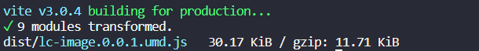
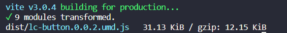
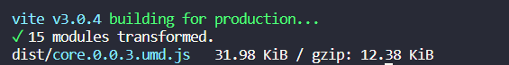

# 重构思路

## editor

## 组件/插件包第三方化

### 单组件仓库 改为 多组件仓库

开发环境仍要手动导`umd.js`，因为前端项目只能指定路径而不能全部导入或者正则匹配。

一个简单的思路是做成接口，需要后端返回对应脚本url数组，但这样对第三方开发并不友好。不过这种形式以后一定会用到，可以留意。

另一个简单的思路就是将**每个仓库只能有一个组件**改为**每个仓管可以有多个组件**，当组件增删时，不需要自己手动添加或删除。

加之创建仓库其实是很麻烦的操作，与高效开发背道而驰。于是采用了上面的方案二。

这样做的好处还有大幅减少体积。以下是image、button和包含以上两个组件的core打包后的大小：

不过限制也有，那就是插件包信息必须是全量导入的。幸好导入的只是信息（包含了脚本地址），而不是组件，所以注意不要全量挂载即可。

### 配置外置化

编辑器不应有任何关于组件、package的配置，目前编辑器和packages是耦合在一起的，编辑器内置了组件的类型、ID、历史版本，这些信息后续都会放到packages配置组件的地方，确保一个组件的ID、版本号等唯一信息不要出现在两个地方。