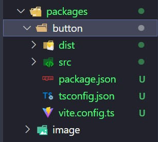
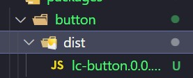
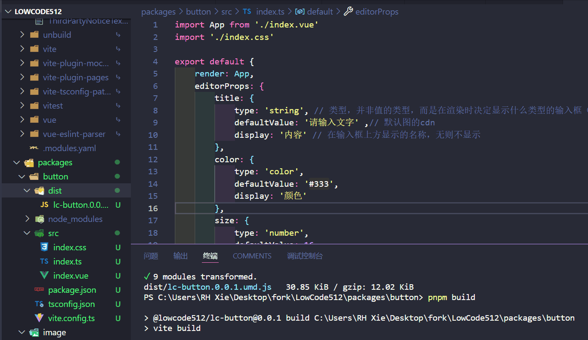
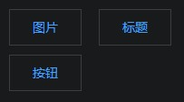
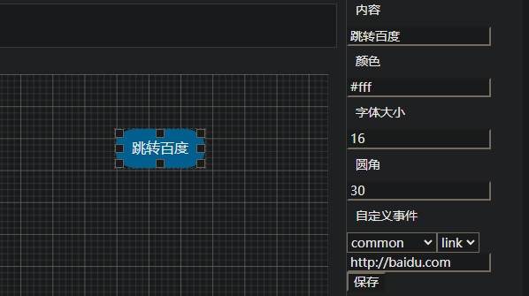
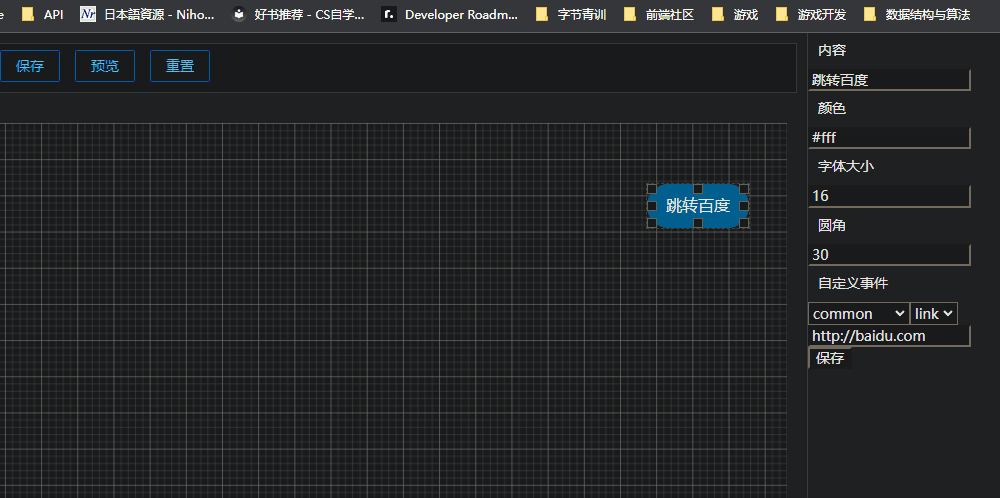
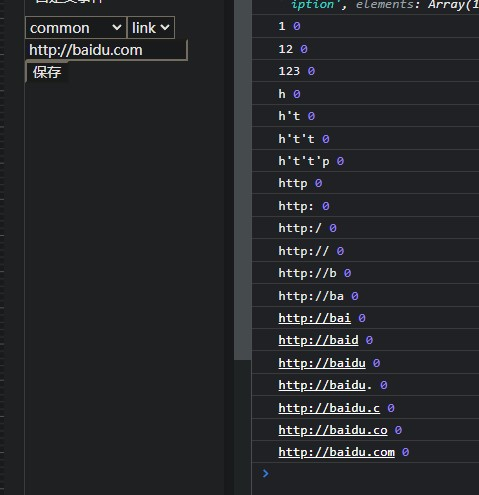

# 如何创建模块

在工作原理中我们简单提到模块src下三个文件的作用，现在我们以创建一个可点击跳转的按钮为例，创建模块。

## 创建模块包
仿照已有的image目录，创建一个目录，目录名为button（不带Lc前缀）



### src/package.json
建议复制已有的包进行修改，这里在button前带上`@lowcode512/`和`lc-`前缀。
```json{2}
{
  "name": "@lowcode512/lc-button",
  "version": "0.0.1",
  "main": "./dist/index.cjs",
  "module": "./dist/index.mjs",
  "types": "./dist/index.d.ts",
  "exports": {
    ".": {
      "import": "./dist/index.mjs",
      "require": "./dist/index.cjs"
    }
  },
  "publishConfig": {
    "access": "public"
  },
  "files": [
    "dist"
  ],
  "scripts": {
    "build": "vite build"
  },
  "keywords": [
    "low-code",
    "typescript"
  ],
  "license": "MIT",
  "dependencies": {
  }
}
```

### tsconfig.json
```json
{
    "extends": "../../tsconfig.json",
    "include": [
        "../../env.d.ts",
        "./src/**/*",
    ],
}
```
### vite.config.ts

需要修改name值。

```typescript{10}
import {defineConfig} from 'vite'
import vue from '@vitejs/plugin-vue';
import pkg from './package.json'

export default defineConfig({
    plugins: [vue()],
    build: {
        lib: {
            entry: './src/index.ts',
            name: 'LcButton',
            fileName: `${pkg.name.split('/')[1]}.${pkg.version}`,
            formats: ['umd'],
        },
        cssCodeSplit: true,
    }
})
```

## 设置`.vue`、`.ts`、`.css`
在vue设置布局，定义参数，如果是从其他模块复制过来，一定要注意各种改名，包括不限于`class`名、
::: details index.vue
```vue
<script setup lang="ts">
const props = defineProps<{
    title: string;
    color: string;
    size: number;
    borderRadius: number;
}>();
</script>

<template>
    <button
        :style="{
            fontSize: size + 'px',
            color: color,
            borderRadius: borderRadius + 'px',
        }"
        class="lc-button"
    >
        {{ title }}
    </button>
</template>
```
:::
::: details index.ts
```typescript
import App from './index.vue'
import './index.css'

export default {
    render: App,
    editorProps: {
        title: {
            type: 'string', // 类型，并非值的类型，而是在渲染时决定显示什么类型的输入框（如选择器、滑块）
            defaultValue: '请输入文字' ,// 默认图的cdn
            display: '内容' // 在输入框上方显示的名称，无则不显示
        },
        color: {
            type: 'color',
            defaultValue: '#333',
            display: '颜色'
        },
        size: {
            type: 'number',
            defaultValue: 16,
            display: '字体大小'
        },
        borderRadius: {
            type: 'number',
            defaultValue: 2,
            display: '圆角'
        }
    }
};
```
:::

（.css此处省略，根据实际编写、参照已有即可）
## 编译`.umd.js`
在包的根目录下：
```
pnpm run build
```
随后你可见dist下有`*.umd.js`格式文件，lc指LowCode，0.0.1为版本号，后面是模块名和后缀


## 拖入编辑器的`public`文件夹




通过`utils.ts`的`loadScript`和`loadMaterial`（在`./src/store/project.ts`下调用），`*.umd.js`将被加载为物料。

## 配置到编辑器
apps/editor/src/data下的`materials.ts`存储着EditorLeft物料栏里的信息。我们在image和title后追加一下信息，编辑器上将会出现该组件，并且

```typescript{2,5,7,8,11,15}
    {
        id: 3,
        type: "component",
        category: {
            name: "基础组件",
        },
        name: "LcButton",
        title: "按钮",
        thumbnail: "",
        version: "0.0.1",
        source: "/lc-button.0.0.1.umd.js",
        data: [
            {
                version: "0.0.1",
                source: "/lc-button.0.0.1.umd.js",
            },
        ],
    },
```

定义完成后，来到编译器，我们可以看到新的组件已经出现：


### 属性

根据你在`defineProps()`（`.vue`）和`editorProps`（`.ts`）中所配置的项，编辑器画布（EditorContent）得到`render`渲染成组件，右侧得到`editorProps`显示相关的属性。



## 自定义事件

需要到与`material.ts`同级目录下的`event.ts`进行配置，这说明两者的作用是有联系的。`event.ts`下的`editorEvents`是一个示例事件，以及一个监听器`globalEmitter`

`type: 'common'`表示事件为通用时间，无论点击任何画布内的元素，都会有该栏事件（简单来说，这个字符串是给编辑器右侧决定是否渲染用的），`events`下是`name`事件名和`args`参数。

具体见EditorRight的“自定义事件”处（搜一下“自定义事件”定位）

为方便展示例子和节省时间，在上面的代码中，我们给`index.vue`加上：

```vue{7,10-13,24}
<script setup lang="ts">
const props = defineProps<{
    title: string;
    color: string;
    size: number;
    borderRadius: number;
    events?: Record<string, any[]>;
}>();
// 一个简单的打开链接事件
function onClick() {
    const link: string = props.events["common:link"][0];
    window.open(link, "_blank");
}
</script>

<template>
    <button
        :style="{
            fontSize: size + 'px',
            color: color,
            borderRadius: borderRadius + 'px',
        }"
        class="lc-button"
        @click="onClick"
    >
        {{ title }}
    </button>
</template>
```

一是给组件添加了点击事件，而是通过window跳转页面，如果打开了控制台，也许还能看到所传的参数，尝试找找它来自哪里吧。（观察image的`.emit`，想想是否在某处见过`.on`?）


### 题外话
谁有时间记得把这个防抖做一下
