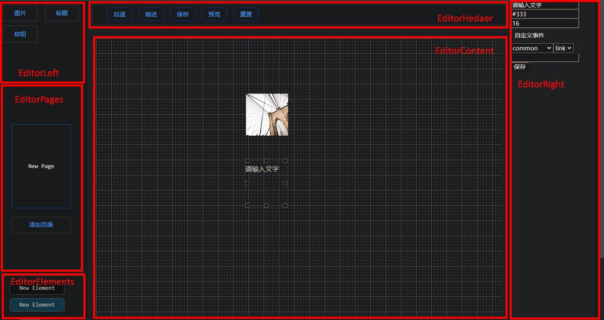

> “我们的目标是星辰大海。”

最后更新：2023-12-23
# 项目概况
项目地址：https://github.com/heartD-bytesD/LowCode512

项目即将开始重构，将对packages和editor进行改造，升级为通用低代码平台，提供第三方开发渠道，扩大平台能力。

重构的范围是前端全部，暂时不需要后端通信。即改造后平台要做PWA和本地存储，存储可以是输入输出特定格式的文件（或者其他方案）。

新增则有几个扩展包，除去基础包core，还有game-2d-basis，charts，umi-lowcode等等（不一定做完，先要有想法，想方案，最后再做）

i18n在本期重构后期做评估，如影响较大放在下次。

重构文档放在了前端项目里，后续也会搬到文档。

## 前言
该文档为提高效率，协调团队合作而开发。

任何成员均可提交更改本文档的内容，原则上根据团队意见进行修改。
## 项目概况
本次开发项目为低代码平台，旨在搭建过程中学习团队协作、项目工程化、前后端配合，巩固基础，拓展新知。祝各位经过本次项目的磨练，能够满载而归。

项目的骨架已成雏形，归功于Monorepo策略，项目对团队分工合作兼容性良好，本就具备**模块与编辑器分离**、**布局与组件逻辑解耦**、**组件与样式分离**的特点。

项目编辑器页面的布局如下，可与apps/editor/src/pages/editor下的各组件分别对应（可能会过时）。

### 技术栈
- 前端框架：Vue3
- 开发语言：TypeScript、Less、前端三件套
- 打包工具：Vite、unbuild
- UI库：Arco Design
- 协作策略：Monorepo
- 状态管理：Pinia + tiny-emitter
- 路由管理：VueRouter + vite-plugin-pages
- 测试：Vitest
- 数据模拟：[vite-plugin-mock](https://www.cnblogs.com/student007/p/15180190.html)

### TODOs概况

项目进度分为三期，时间8.15-8.19、8.20-8.23、8.23-8.25。

**一期组织分工，实现基本功能，计划在19号之前完工。**

**二期大体完善、提升用户体验，计划在23号前完工。**

**三期优化、加高级功能。**

因为时间紧迫，我们的目标是做完二期，三期看情况，能完成尽量完成。

PPT制作以二期结束为标准，届时队内开展一次对项目的复盘，理清结构，总结一次自已经完成的功能，寻求可能更好的方向，总结优势与不足。答辩有代码展示环节，因此需要明晰自己所模块的思路、代码的含义，以此迎接答辩。

复盘完成后，剩余和空隙的时间便进行三期的开发，PPT制作相关的同学可不参与三期开发，针对三期新增内容对PPT进行调整润色。
